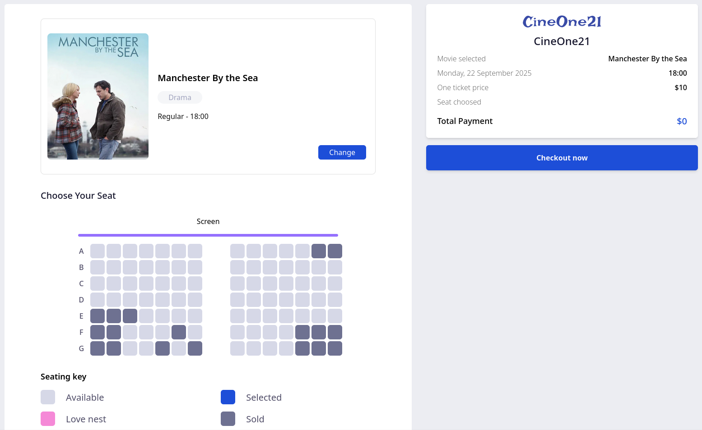

# Tickitz - Cinema Ticket Booking Frontend

## 📖 Project Overview

**Tickitz** is a modern cinema ticket booking web application that provides a seamless movie booking experience from browsing to ticket generation.

**Technologies Used:**
- React + Vite (Frontend framework & bundler)
- Context API & Redux (State management)
- Sonner (Toast notifications)
- NGINX (Deployment)

**Key Features:**
- 🔐 **Authentication** - Sign Up, Sign In, Forget Password
- 🏠 **Home Page** - Landing page with movie highlights
- 🎬 **Movie Catalog** - Browse popular and upcoming movies
- 📄 **Movie Details** - Detailed movie information and showtimes
- 🎫 **Seat Selection** - Interactive seat booking interface
- 💳 **Payment System** - Multiple payment method options
- 🎟️ **E-Ticket** - Digital ticket generation after payment

## 🚀 Instructions

**Environment Requirements:**
- Node.js 18+ 
- npm or yarn

**Installation & Usage:**
```bash
# Clone repository
git clone https://github.com/radifan9/tickitz-ticketing-react.git
cd tickitz-ticketing-react

# Install dependencies
npm install

# Start development server
npm run dev

# Build for production
npm run build
```

## 📱 Screenshots

### Home Page


### Movie Selection


### Seat Selection


### Payment Process


*Note: Add actual screenshots to `/public/screenshots/` directory*

## ℹ️ Other Information

**License:** MIT

**Contact:** 
- GitHub: [@radifan9](https://github.com/radifan9)

**Related Project:**
- [Tickitz Backend](https://github.com/radifan9/tickitz-ticketing-backend) - API server for this application

**Project Structure:**
```
src/
├── components/     # Reusable components
├── contexts/       # React Context providers
├── redux/          # Redux state management
├── pages/          # Application pages
├── data/           # Static data and constants
├── hooks/          # Custom React hooks
└── utils/          # Utility functions
```